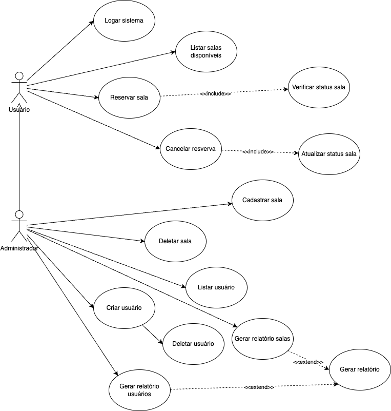

# Especificações do Projeto

Pré-requisitos: <a href="1-Documentação de Contexto.md"> Documentação de Contexto</a>

DOs desafios cruciais para o projeto foram identificados através de um processo de imersão, envolvendo observação e entrevistas com os usuários em seu contexto natural. Essas informações foram sintetizadas em personas e histórias de usuário, proporcionando uma compreensão precisa das necessidades e dores dos usuários. Essa abordagem orientou a construção de um sistema mais eficaz e centrado no usuário.

## Personas

- 
- 
- 
- 
- 
- 

## Histórias de Usuários

Com base na análise das personas forma identificadas as seguintes histórias de usuários:

|EU COMO... `PERSONA`| QUERO/PRECISO ... `FUNCIONALIDADE`                                     |PARA ... `MOTIVO/VALOR`                 |
|--------------------|------------------------------------------------------------------------|----------------------------------------|
|Ana Silva           | Integração dos calendários individuais dos funcionários.               | Evitar conflitos no agendamento de reuniões.               |
|Mauricio Duarte     | Visualizar rapidamente a disponibilidade de todas as salas de reunião. | facilitando a escolha da sala mais adequada para o evento. |
|João Carvalho       | Sistema de notificações e alertas para lembrar os participantes sobre suas reuniões agendadas.  | alertar sobre possíveis conflitos de horário. |
|Anna de Lucca       | Capacidade de agendar reuniões recorrentes, como reuniões semanais ou mensais. | Para agilidade no gerenciamento de reuniões com o time. |
|Lineu Silva         | Relatórios sobre a utilização das salas de reunião ao longo do tempo.  | Permitindo uma melhor gestão dos recursos. |
|Mauricio Duarte     | Gerenciamento de salas de reunião por níveis de perfil                 | Que diferentes níveis de perfil tenham diferentes permissões e acessos. |
|Ana Silva           | Poder visualizar as reuniões marcadas em cada sala de reunião.         | Para não ter conflito de reuniões já marcadas. | 
|Lineu Silva         | Facilitar o agendamento de reuniões.                                   | Melhorar as tarefas rotineiras.
|Anna de Lucca       | Deixar planejado as reuniões de um mês inteiro.                        | Para poder se organizar com antecedência. |
|João Carvalho       | Realizar 1:1 com todos membros da sua equipe, evitando marcar em horários já preenchidos. | Mecanismo que evite agendamentos durante o mesmo horário. |

## Requisitos

O escopo funcional do projeto é definido por meio dos requisitos funcionais que descrevem as possibilidades interação dos usuários, bem como os requisitos não funcionais que descrevem os aspectos que o sistema deverá apresentar de maneira geral. Estes requisitos são apresentados a seguir.

### Requisitos Funcionais

|ID    | Descrição do Requisito  | Prioridade |
|------|-----------------------------------------|----|
|RF-001| A aplicação deve permitir que o usuário realize o login | ALTA | 
|RF-002| A aplicação deve permitir criar diferentes tipos de usuários (administrador, comum)   | ALTA |
|RF-003| A aplicação deve permitir que o usuário "administrador" adicione novos usuários   | ALTA |
|RF-004| A aplicação deve permitir que o usuário "administrador" delete usuários   | ALTA |
|RF-005| A aplicação deve permitir que o usuário "administrador" atualize usuários   | ALTA |
|RF-006| A aplicação deve permitir que o usuário "administrador" liste os usuários   | ALTA |
|RF-007| A aplicação deve permitir que o usuário "administrador" cadastre salas de reuniões   | ALTA |
|RF-008| A aplicação deve permitir que todos os usuários possam reversar uma sala de reunião   | ALTA |
|RF-009| A aplicação não deve permitir que um usuário reserve uma sala em um horário já ocupado   | ALTA |
|RF-010| A aplicação deve permitir que o usuário "administrador" emita relatórios do sistema   | ALTA |
|RF-011| A aplicação deve possuir um relatório de utilização da sala que deve informar a sala e quantidade de horas reservadas   | ALTA |
|RF-012| A aplicação deve possuir um relatório de utilização dos usuários que deve informar o usuário e quantidade de horas reservadas   | MÉDIA |
|RF-013| A aplicação permitir que o usuário cancele sua reserva   | MÉDIA |
|RF-014| A aplicação deve permitir que o usuário "administrador" delete salas de reuniões   | BAIXA |
|RF-015| A aplicação deve permitir que o usuário "administrador" atualize salas de reuniões   | BAIXA |
|RF-016| A aplicação deve permitir que o usuário "administrador" liste as salas de reuniões   | BAIXA |

### Requisitos não Funcionais

|ID     | Descrição do Requisito  |Prioridade |
|-------|-------------------------|----|
|RNF-001| A aplicação deve ser responsiva | ALTA | 
|RNF-002| A aplicação deve ser acessada através de um navegador de internet |  ALTA | 
|RNF-003| A aplicação deve processar requisições do usuário em no máximo 3s |  MÉDIA | 
|RNF-004| A aplicação deve compatível com os principais navegadores de internet |  MÉDIA | 
|RNF-005| A aplicação deve compatível com os principais navegadores de internet |  BAIXA | 
|RNF-006| A aplicação deve ser segura permitindo apenas a utilização se senhas "FORTES" |  BAIXA | 

## Restrições

O projeto está restrito pelos itens apresentados na tabela a seguir.

|ID| Restrição                                             |
|--|-------------------------------------------------------|
|RE-01| O projeto deverá ser entregue no final do semestre letivo, não podendo extrapolar a data de 23/06/2024. |
|RE-02| As tecnologias que serão utilizadas na aplicação serão: C# para desenvolver o backend que gerencia as reservas, MySQL para armazenar os dados das salas e reservas. JavaScript, CSS, HTML e Bootstrap para a interface do usuário. |
|RE-03| A aplicação deverá estar funcionando no servidor da microsoft. |

## Diagrama de Casos de Uso

