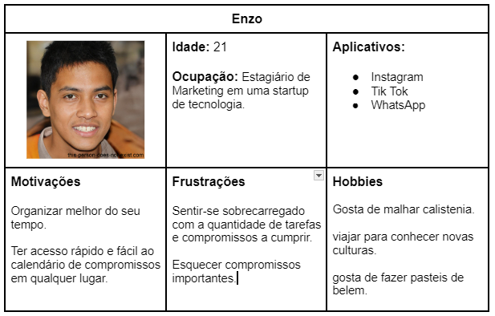
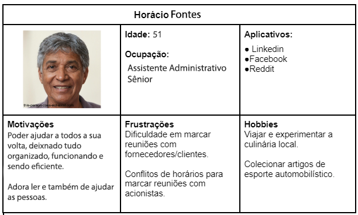
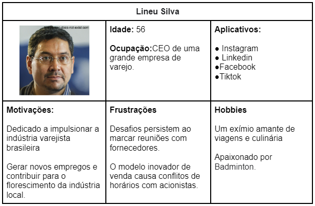

# Especificações do Projeto

Pré-requisitos: <a href="1-Documentação de Contexto.md"> Documentação de Contexto</a>

DOs desafios cruciais para o projeto foram identificados através de um processo de imersão, envolvendo observação e entrevistas com os usuários em seu contexto natural. Essas informações foram sintetizadas em personas e histórias de usuário, proporcionando uma compreensão precisa das necessidades e dores dos usuários. Essa abordagem orientou a construção de um sistema mais eficaz e centrado no usuário.

## Personas

## Histórias de Usuários

Com base na análise das personas forma identificadas as seguintes histórias de usuários:

|EU COMO... `PERSONA`| QUERO/PRECISO ... `FUNCIONALIDADE`                                     |PARA ... `MOTIVO/VALOR`                 |
|--------------------|------------------------------------------------------------------------|----------------------------------------|
|Ana Silva           | 
Identificar de forma intuitiva e clara a Integração dos calendários individuais dos colaboradores (gestores, colegas, outros times etc.) | Evitar conflitos no agendamento de reuniões.               |
|Mauricio Duarte     | Visualizar rapidamente a disponibilidade de todas as salas de reunião. | facilitando a escolha da sala mais adequada para o evento. |
|João Carvalho       | Sistema de notificações e alertas para lembrar os participantes sobre suas reuniões agendadas.  | alertar sobre possíveis conflitos de horário. |
|Anna de Lucca       | Capacidade de agendar reuniões recorrentes, como reuniões semanais ou mensais. | Para agilidade no gerenciamento de reuniões com o time. |
|Lineu Silva         | Relatórios sobre a utilização das salas de reunião ao longo do tempo.  | Permitindo uma melhor gestão dos recursos. |
|Horacio Fontes | Gerenciamento de salas de reunião por níveis de perfil                 | onde diferentes níveis de perfil tenham diferentes permissões e acessos. |
|Ana Silva           | Poder visualizar as reuniões marcadas em cada sala de reunião.         | Para não ter conflito de reuniões já marcadas. | 
|Lineu Silva         | Facilitar o agendamento de reuniões.                                   | Melhorar as tarefas rotineiras e ter dados sob re performance.
|João Carvalho       | Cancelar as reservas realizadas                                        | imprevistos de clientes, deixando as salas disponíveis para outros. |

## Requisitos

O escopo funcional do projeto é definido por meio dos requisitos funcionais que descrevem as possibilidades interação dos usuários, bem como os requisitos não funcionais que descrevem os aspectos que o sistema deverá apresentar de maneira geral. Estes requisitos são apresentados a seguir.

### Requisitos Funcionais

|ID    | Descrição do Requisito                                                                 | Prioridade |
|------|----------------------------------------------------------------------------------------|------------|
|RF-001| A aplicação deve permitir que o usuário realize o login                                | ALTA | 
|RF-002| A aplicação deve permitir criar diferentes tipos de usuários (administrador, comum)    | ALTA |
|RF-003| A aplicação deve permitir que o usuário "administrador" adicione novos usuários        | ALTA |
|RF-004| A aplicação deve permitir que o usuário "administrador" delete usuários                | ALTA |
|RF-005| A aplicação deve permitir que o usuário "administrador" atualize usuários              | ALTA |
|RF-006| A aplicação deve permitir que o usuário "administrador" liste os usuários              | ALTA |
|RF-007| A aplicação deve permitir que o usuário "administrador" cadastre salas de reuniões     | ALTA |
|RF-008| A aplicação deve permitir que todos os usuários possam reservar uma sala de reunião no dia, semana ou mês, podendo colocar mais que uma única data   | ALTA |
|RF-009| A aplicação não deve permitir que um usuário reserve uma sala em um horário já ocupado | ALTA |
|RF-010| A aplicação deve permitir que o usuário "administrador" emita relatórios do sistema    | ALTA |
|RF-011| A aplicação deve possuir um relatório de utilização da sala que deve informar a sala e quantidade de horas reservadas   | ALTA |
|RF-012| A aplicação deve possuir um relatório de utilização dos usuários que deve informar o usuário e quantidade de horas reservadas   | MÉDIA |
|RF-013| A aplicação permite que o usuário cancele suas reservas                                | MÉDIA |
|RF-014| A aplicação deve permitir que o usuário "administrador" delete salas de reuniões       | BAIXA |
|RF-015| A aplicação deve permitir que o usuário "administrador" atualize salas de reuniões     | BAIXA |
|RF-016| A aplicação deve permitir que o usuário "administrador" liste as salas de reuniões     | BAIXA |
|RF-017| A aplicação deve permitir que os usuários consigam acessar os perfis dos colaboradores, podendo ver seus calendários   | ALTA |
|RF-018| A aplicação deve emitir um alerta avisando o compromisso e o tempo que falta para iniciar (5 min, 10 min, 15 min, 30 mint, uma hora, 1 dia antes ou personalizado)  | MEDIA |
|RF-019| A aplicação deve emitir um alerta avisando possíveis conflitos de horário com outros usuários vinculados ao compromisso  | MEDIA |
|RF-020| A aplicação deve permitir que os tipos de usuários sejam classificados por setor e nível hierarquico, agregando assim tipos de interações diferentes na aplicação       | ALTA |
|RF-021| A aplicação deve ter uma aba onde seja possível verificar as salas disponíveis, os andares, os dias e horários. Nessa aba será possível verificar os hosrários que as salas estão ocupadas e livres| ALTA |
|RF-022|  A aplicação permitir que o usuário modifique a sua reserva | MÉDIA |
|RE-023| Haverá um Limite de quantidade de seservas de uma mesma sala por usuário, não podendo agenda-la para um período maior que 4 horas (juntando todas as reservas realizadas, calculando o tempo de todas para um mesmo dia).

### Requisitos não Funcionais

|ID     | Descrição do Requisito  |Prioridade |
|-------|-------------------------|----|
|RNF-001| A aplicação deve ser responsiva | ALTA | 
|RNF-002| A aplicação deve ser acessada através de um navegador de internet |  ALTA | 
|RNF-003| A aplicação deve processar requisições do usuário em no máximo 3s |  MÉDIA | 
|RNF-004| A aplicação deve compatível com os principais navegadores de internet |  MÉDIA | 
|RNF-005| A aplicação deve compatível com os principais navegadores de internet |  BAIXA | 
|RNF-006| A aplicação deve ser segura permitindo apenas a utilização se senhas "FORTES" |  BAIXA | 

## Restrições

O projeto está restrito pelos itens apresentados na tabela a seguir.

|ID| Restrição                                             |
|--|-------------------------------------------------------|
|RE-01| O projeto deverá ser entregue no final do semestre letivo, não podendo extrapolar a data de 23/06/2024. |
|RE-02| As tecnologias que serão utilizadas na aplicação serão: C# para desenvolver o backend que gerencia as reservas, MySQL para armazenar os dados das salas e reservas. JavaScript, CSS, HTML e Bootstrap para a interface do usuário. |
|RE-03| A aplicação deverá estar funcionando no servidor da microsoft. |

## Diagrama de Casos de Uso

