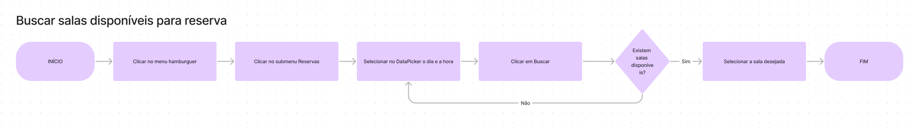
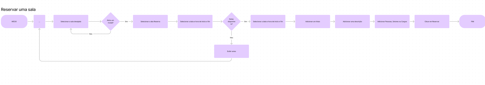
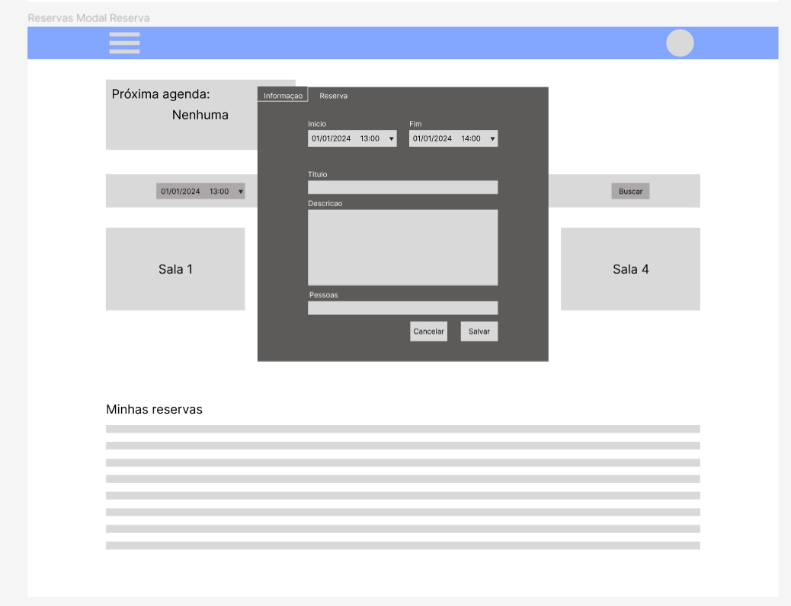
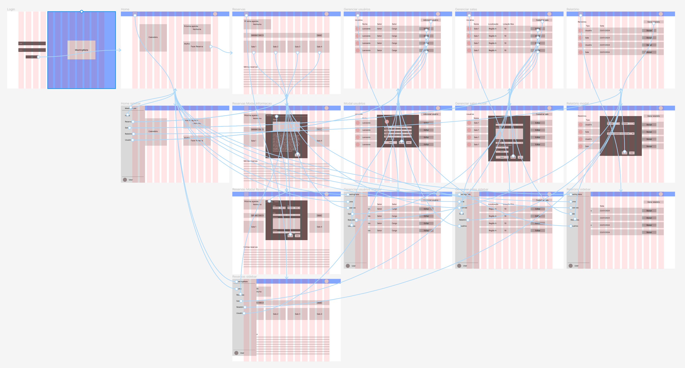
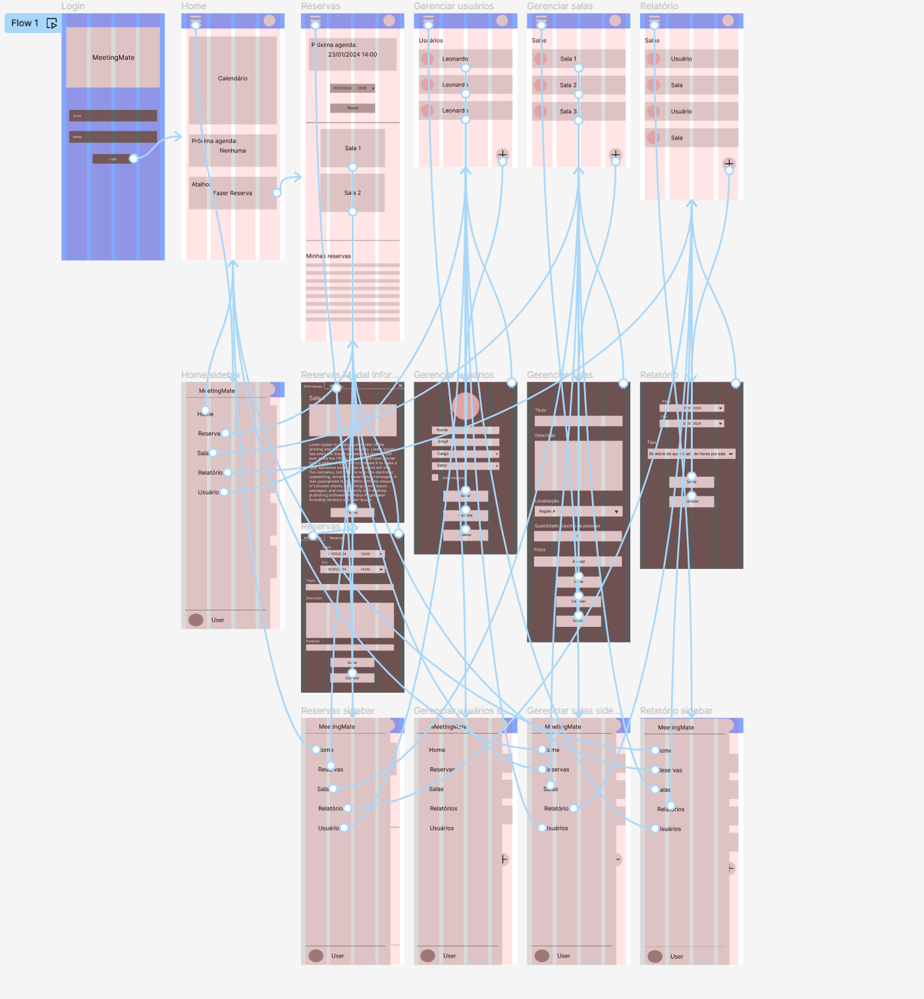

# Projeto de Interface

Pré-requisitos: <a href="2-Especificação do Projeto.md"> Documentação de Especificação</a>

Visão geral da interação do usuário pelas telas do sistema e protótipo interativo das telas com as funcionalidades que fazem parte do sistema (wireframes).

## Diagrama de Fluxo

O diagrama apresenta o estudo do fluxo de interação do usuário com o sistema interativo e  muitas vezes sem a necessidade do desenho do design das telas da interface. Isso permite que o design das interações seja bem planejado e gere impacto na qualidade no design do wireframe interativo que será desenvolvido logo em seguida.

Para esse projeto foram desenvolvidos diversos diagramas de fluxos específicos para cada Requisito funcional, visando a melhor leitura, validação e implementação.

Os diagrams de fluxo podem ser acessos a partir do projeto do FIgJam: [Link de acesso](https://www.figma.com/file/9qTTg4WiJrPy7AhvAXZ88R/Untitled?type=whiteboard&node-id=0%3A1&t=pwMIwF4H7h6ENy7i-1)

<figure> 
  
    <figcaption>Figura 1 - Buscar salas disponíveis para reserva</figcaption>
</figure> 

<figure> 
  
    <figcaption>Figura 2 - Reservar uma sala</figcaption>
</figure> 

## Wireframes

Wireframes apresentam de forma simplificada o design da interface e o relacionamento entre suas páginas, permitindo evolução da proposta da solução. Neste projeto, os utilizaremos para apoiar a validação dos requisitos e efetuar mudanças dos mesmos, caso seja necessário, para menor impacto na codificação da aplicação.

Para esse projeto foram desenvolvidos dois wireframes, uma versão web e outra mobile, visto que um dos requisitos da aplicação é sua responsividade.

O wireframe pode ser acessado a partir do projeto do figma: [Link de acesso](https://www.figma.com/file/UqTVVayDzbH1Ix1MEd0Iw8/MeetingMate?type=design&node-id=0%3A1&mode=design&t=wV5rpgEiSKiy0fvk-1)

<figure> 
  
    <figcaption>Figura 3 - Wireframe Modal Reserva</figcaption>
</figure> 

## Protótipo interativo

Os protótipos interativos possuem um papel fundamental no processo de desenvolvimento de software, permitindo validar a navegabilidade e usabilidade de uma aplicação de forma eficiente e econômica. Eles representam uma simulação dinâmica do comportamento de um sistema que ainda está em fase de desenvolvimento, permitindo que os designers e desenvolvedores testem diversas interações e fluxos de usuário antes da implementação final

Para esse projeto foram desenvolvidos dois protótipos, uma versão web e outra mobile, visto que um dos requisitos da aplicação é sua responsividade.

O protótipo pode ser acessado e executado a partir do projeto do figma: [Link de acesso](https://www.figma.com/file/UqTVVayDzbH1Ix1MEd0Iw8/MeetingMate?type=design&node-id=0%3A1&mode=design&t=wV5rpgEiSKiy0fvk-1)

<figure> 
  
    <figcaption>Figura 4 - Protótipo Desktop</figcaption>
</figure> 

<figure> 
  
    <figcaption>Figura 5 - Protótipo Mobile</figcaption>
</figure> 