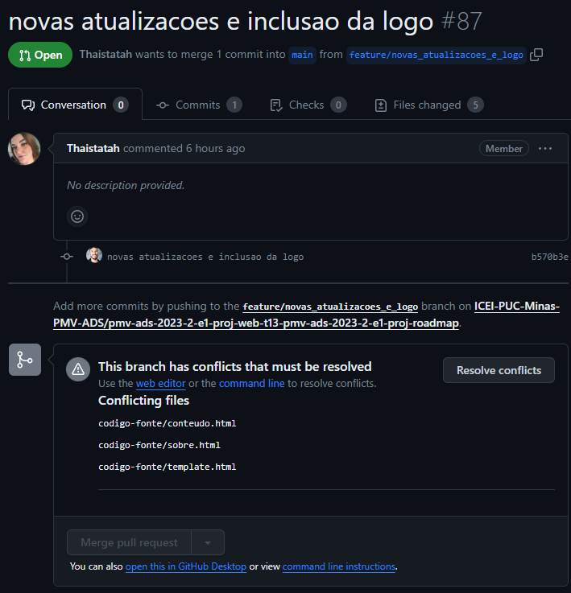
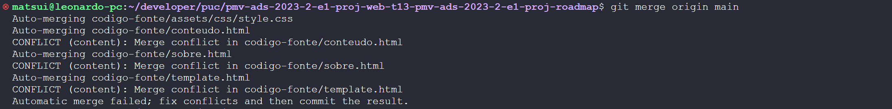
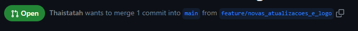
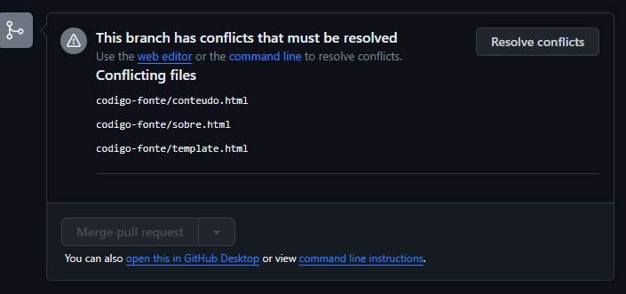
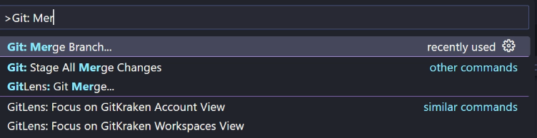
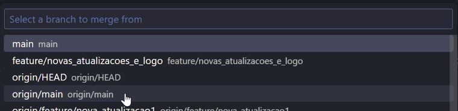
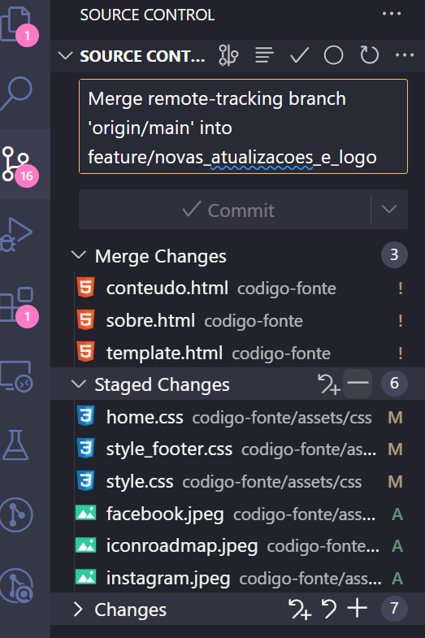
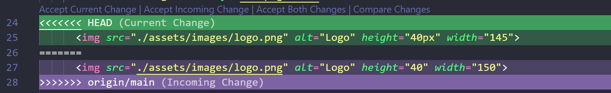
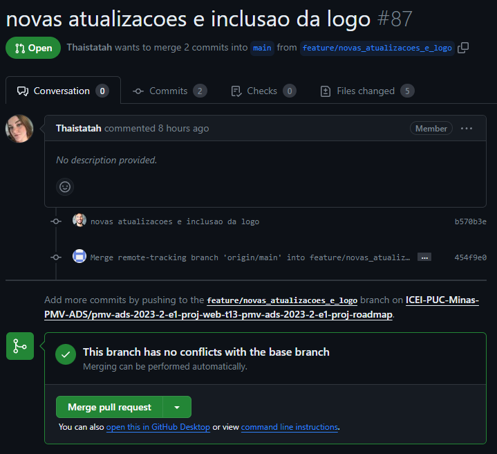

# Como lidar com conflitos?
Esse documento tem o propósito de servir como guia para correção de conflitos em códigos, utilizando apenas o vscode sem a necessidade de linhas de comando.
Essa não é a maneira mais rápida, porém é a mais simples para a compreensão do fluxo de correção de conflitos.

## Primeiro, o que são conflitos?
Um conflito ocorre ao tentar mergear duas branchs que possuem alterações diferentes no mesmo arquivo e mesmo local

Por exemplo:
Existem duas branchs sendo elas a branch/A e a branch/B

A branch/A, possui alteração no arquivo index.html na linha 14 onde ela adiciona o seguinte:
```
<p> Alteracao da branch A <p>
```

A branch/B, também possui alteração no arquivo index.html na mesma linha 14 onde ela adiciona:
```

```

Ao tentar juntar essas duas branchs (realizar o merge) o git precisa de uma ajuda para saber o que realmente precisa ser feito, se a alteração correta é a da branch/A, da branch/B ou até mesmo das duas

### Mas por que existiriam duas alterações diferentes para o mesmo arquivo?
No geral cada desenvolvedor trabalha na sua específica branch que se originou de uma em comum para todos.

Por exemplo: o Dev A criou uma nova branch com base na "main". O Dev B também criou uma nova branch com base na "main"

No exato momento que os dois criaram uma nova branch, a "main" estava atualizada e igual para ambos. Mas o Dev A finalizou sua tarefa primeiro e sua branch foi mergeada na main.
A partir desse momento, a branch do dev B que tinha sido criada com base na main está desatualizada e caso ele tenha alterado o mesmo arquivo e local que o Dev A alterou, na hora de abir um Pull requet será sinalizado o conflito.

## Como saber se existe um conflito de código?
As duas maneiras mais comuns sao na abertura de um pull request onde a ferramente de git irá sinalizar o conflito e impedir o merge até que ele seja corrigido, ou ao atualizar a branch de trabalho com outra

### Ferramenta de git


### Ao tentar atualizar o código da sua branch com outra


## Como inicar a correção dos conflitos?
É necessário ter o conhecimento de duas informações: qual a branch que vai receber a atualização e qual branch vai fornecer a atualização?

Essa informação pode ser conferida na descrição do pull request.



Nesse caso a branch que vai receber a atualizacao é a "main" e a branch que vai fornecer a atualizacao é a "feature/novas_atualizacoes_e_logo"

Ainda no Pull Request, o git informa que existem conflitos em tres arquivos.




### Exibindo os conflitos no VsCode
No vscode é necessário alterar para a branch que está fornecendo a atualização (feature/novas_atualizacoes_e_logo) e atualizar ela (git pull).

Após isso é necessário atualizar ela novamente, mas agora com a versao mais atual da branch que vai receber a atualização (main). 

Para isso no vscode utiliza-se a combinacao de teclas ctrl+shift+P para abrir uma caixa de pesquisa e procurar funcao "Git: Merege Branch..."



Será solicitado informar qual branch deve ser utilizada para atualizar, nesse caso será a main.

Obs: É necessário selecionar a branch com prefixo "origin/" esse prefixo significa que a branch utilizada será do repositório online onde está mais atualizada, sem esse prefixo seria utilizado do próprio computador que pode não ser a mais atual.



Pronto, agora o vscode irá sinalizar que existem alteracoes locais



## Como corrigir os conflitos
O VsCode sinaliza os conflitos com o simbolo "!" na frente do arquivo como mostrado na imagem anterior.

Ao selecionar o arquivo será destacado as partes com conflitos e algumas opcoes.


É mostrado a versao "Current change" que se refere a alteracao que está na branch feature/novas_atualizacoes_e_logo.
E "Incoming Change" que se refere a alteracao que está na branch main

As opcoes existentes sao
- Accept Current change - manter apenas a alteracao da feature/novas_atualizacoes_e_logo
- Accept Incoming Change - manter apenas a alteracao da main
- Accept both changes - manter ambas as alteracoes

Após selecionado uma das opcoes deve ser salvo o arquivo e realizado o Stage da alteracao.


Depois de ter sido corrigido o conflito de todos os arquivos, deve ser realizado o commit e push

Após isso o conflito está resolvido e caso exista algum pull request ele estará liberado.

